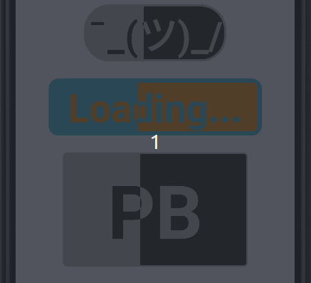

**Note:** updated version of this library will be available [here](https://github.com/arsen-simonyan/ProgressButton/releases).

[](https://jitpack.io/#arsen-simonyan/ProgressButton)
[](http://android-arsenal.com/details)
[](https://android-arsenal.com/api?level=23)

### Description

Android button that can show progress



### Wiki

- [Home]
- [Screenshots]

### Integration

The lib is available on Maven Central, you can find it with [Gradle, please]

```
allprojects {
   repositories {
      ...
      maven { url 'https://jitpack.io' }
   }
}
```

```
dependencies {
    implementation 'https://github.com/arsen-simonyan/ProgressButton:$latest'
}
```

[Home]:https://github.com/arsen-simonyan/ProgressButton/wiki
[Screenshots]:https://github.com/arsen-simonyan/ProgressButton/wiki/Screenshots
